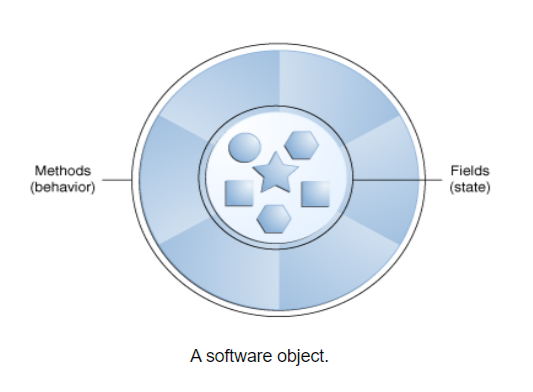

# Java-OOPS

## <span style="color:#0d6efd">Why we need class and objects?</span>


- Classes and objects allow you to model real-world entities or abstract concepts in your program.
- Classes and objects are used to create reusable code.
- To increases the flexibility and maintainability of the program.


## <span style="color:#0d6efd">Class and Objects.</span>

### <span style="color:#0d6efd">What is a class?</span>
-  A class is the blueprint from which individual objects are created.
- In the real world, you'll often find many individual objects all of the same kind.
- Example : 

```java
    public class Student{
        String studentName;
        String studentId;

        Student(studentName, studentId){
            this.studentName = studentName;
            this.studentId = studentId;
        }

        public void studentInfo(){
            System.out.println("Student Name : " + studentName);
            System.out.println("Student ID : " + studentId);
        }
    }

```

- The above *Student* class is blue print.
- *studentName*, *studentId* are the object's states.
- This class doesn't contain main method because it's just the blueprint for *Student* that might be used in an application.


### <span style="color:#0d6efd">What is an object?</span>
- Objects are key to understanding object-oriented technology.
- Real-world objects share two characteristics: They all have state and behavior. 
- Software objects are conceptually similar to real-world objects: they too consist of state and related behavior. 
- An object stores its state in fields (variables in some programming languages) and exposes its behavior through methods (functions in some programming languages). 

[]()

- Bundling code into individual software objects provides a number of benefits, including:
  1. modularity.
  2. Information-hiding.
  3. Code Re-use.
  4. Debugging ease.

```java

    public class StudentObject {
        public static void main(String[], args){
            Student s1 = new Student();
        }
    }

```

- In above code, We are creating object of *Student* class.
- **new** key word used to create new instance.


## <span style="color:#0d6efd">Constructor</span>


- A class contains constructors that are invoked to create objects from the class blueprint. 
- Constructor declarations look like method declarations *except* that they use the name of the class and have no return type.
- Constructors are only called once, at object creation.
- Memory allocation happens when constructor is called.

```java
    public class Student{
        String studentName;
        String studentId;

        Student(studentName, studentId){
            this.studentName = studentName;
            this.studentId = studentId;
        }

        public void studentInfo(){
            System.out.println("Student Name : " + studentName);
            System.out.println("Student ID : " + studentId);
        }
    }


    public class StudentObject {
        public static void main(String[], args){
            Student s1 = new Student("XYZ", 101);
        }
    }
```
- Above is the constructor of *Student* class.
- *new Student("XYZ", 101)* creates space in memory for the object and initializes its fields.
- the Java platform differentiates constructors on the basis of the number of arguments in the list and their types.
- You cannot write two constructors that have the same number and type of arguments for the same class, because the platform would not be able to tell them apart. Doing so causes a compile-time error.
- **Types of constructors**
    1. *Default constructor* - if their is no constructor defined then compiler generates default constructor.
    2. *parameterized constructor* - this type of constructor declare by passing parameters to constructor.
    3. *non-parameterized constructor* - as name suggest we declare constructor without passing parameters.
    4. *Copy constructor* - Unlike other constructors copy constructor is passed with another object which copies the data available from the passed object to the newly created object.

```java 
    public class Student{
        String studentName;
        String studentId;

        //non-parameterized constructor
        Student(){
            ...
        }

        //parameterized constructor
        Student(String studentName, String studentId){
            this.studentName = studentName;
            this.studentId = studentId;
        }

        //Copy constructor
        Student(Student s){
            ...
        }
    }

```

## <span style="color:#0d6efd">Static, Local and Instance variable.</span>

1. **static variable** (Class variable) 
    - Definition: Static variables are declared using the static keyword and belong to the class itself, not to any instance of the class. They are shared among all instances of the class.
    ```java 
        public class MyClass {
            static int count = 0;
            // ...
        }
    ```
2. **local variable** 
    - Local variables are declared within a method, constructor, or block and have limited scope. They exist only for the duration of the method call or block execution.
    ```java
        public void myMethod() {
            int localVar = 42;
            // ...
        }
    ```
3. **instance variable**
    - Instance variables are declared within a class but outside any method. Each instance of the class has its own copy of these variables.
    ```java
        public class MyClass {
            int instanceVar = 0;
            // ...
        }
    ```

- Use static variables for shared data across all instances of a class or for constants.

- Use instance variables for attributes specific to each object (instance) of a class.

- Use local variables for temporary storage within methods or blocks.


## <span style="color:#0d6efd">Polymorphism and it's types</span>


- Polymorphism allows us to perform a single action in different ways. 
- In other words, polymorphism allows you to define one interface and have multiple implementations.

**Types**
1. Compile-time polymorphism.
2. Runtime Polymorphism.

**Compile-time**
- It is also known as static polymorphism. 
- This type of polymorphism is achieved by method overloading.
- Method Overloading - When there are multiple functions with the same name but different parameters then these functions are said to be overloaded. Functions can be overloaded by changes in the number of arguments or/and a change in the type of arguments. 

**Runtime**
- Run-Time Polymorphism is a procedure where the program execution takes place during Run-Time. 
- Here, the resolution of an overriding happens in the execution stage. 
- There are two occurrences of Run-Time Polymorphism.
- Method Overriding - Method Overriding is a procedure in which the compiler can allow a child class to implement a specific method already provided in the parent class.


## <span style="color:#0d6efd">Inheritance and it's types</span>

- Inheritance is one of the object-oriented programming concepts in Java. 
- Inheritance enables the acquisition of data members and properties from one class to another.
- Types of Inheritance in Java
    1. Single Inheritance
    2. Multi-Level Inheritance
    3. Hierarchical Inheritance
    4. Hybrid Inheritance
    5. Multiple Inheritance

**Single Inheritance**
- Single inheritance consists of one parent class and one child class. The child class inherits parent class methods and data members.

**Multi-Level Inheritance**
- Multi-level inheritance is like a parent-child inheritance relationship—the difference is that a child class inherits another child class.

**Hierarchical Inheritance**
- Hierarchical inheritance is a parent-child relationship. The only difference is that multiple child classes inherit one parent class.

**Hybrid Inheritance**
- Hybrid inheritance can be a combination of any of the three types of inheritances supported in Java

**Multiple Inheritance**
- There is also a fifth type of Inheritance, but it is not supported in Java, as multiple class inheritance causes ambiguities.
- Multiple inheritance is also called a diamond problem. Hence, Java does not support multiple class inheritance.
